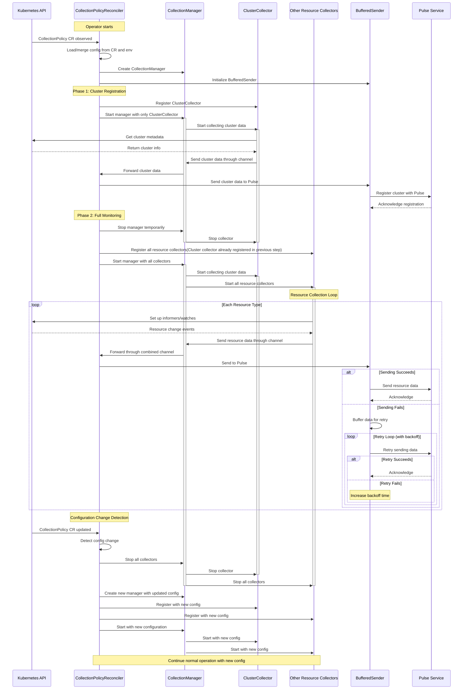

```mermaid
sequenceDiagram
    participant Kube as Kubernetes API
    participant Operator as CollectionPolicyReconciler
    participant Manager as CollectionManager
    participant Cluster as ClusterCollector
    participant Collectors as Other Resource Collectors
    participant Transport as BufferedSender
    participant Pulse as Pulse Service
    
    Note over Operator: Operator starts

    Kube->>Operator: CollectionPolicy CR observed
    Operator->>Operator: Load/merge config from CR and env
    Operator->>Manager: Create CollectionManager
    Operator->>Transport: Initialize BufferedSender

    Note over Operator: Phase 1: Cluster Registration

    Operator->>Cluster: Register ClusterCollector
    Operator->>Manager: Start manager with only ClusterCollector
    activate Manager
    Manager->>Cluster: Start collecting cluster data
    activate Cluster
    Cluster->>Kube: Get cluster metadata
    Kube-->>Cluster: Return cluster info
    Cluster->>Manager: Send cluster data through channel
    Manager->>Operator: Forward cluster data
    Operator->>Transport: Send cluster data to Pulse
    Transport->>Pulse: Register cluster with Pulse
    Pulse-->>Transport: Acknowledge registration
    
    Note over Operator: Phase 2: Full Monitoring
    
    Operator->>Manager: Stop manager temporarily
    Manager->>Cluster: Stop collector
    deactivate Cluster
    deactivate Manager
    
    Operator->>Collectors: Register all resource collectors(Cluster collector already registered in previous step)
    Operator->>Manager: Start manager with all collectors
    activate Manager
    
    Manager->>Cluster: Start collecting cluster data
    activate Cluster
    Manager->>Collectors: Start all resource collectors
    activate Collectors
    
    Note over Collectors: Resource Collection Loop

    loop Each Resource Type
        Collectors->>Kube: Set up informers/watches
        Kube-->>Collectors: Resource change events
        Collectors->>Manager: Send resource data through channel
        Manager->>Operator: Forward through combined channel
        Operator->>Transport: Send to Pulse
        
        alt Sending Succeeds
            Transport->>Pulse: Send resource data
            Pulse-->>Transport: Acknowledge
        else Sending Fails
            Transport->>Transport: Buffer data for retry
            loop Retry Loop (with backoff)
                Transport->>Pulse: Retry sending data
                alt Retry Succeeds
                    Pulse-->>Transport: Acknowledge
                else Retry Fails
                    Note over Transport: Increase backoff time
                end
            end
        end
    end
    
    Note over Operator: Configuration Change Detection
    
    Kube->>Operator: CollectionPolicy CR updated
    Operator->>Operator: Detect config change
    Operator->>Manager: Stop all collectors
    Manager->>Cluster: Stop collector
    deactivate Cluster
    Manager->>Collectors: Stop all collectors
    deactivate Collectors
    deactivate Manager
    
    Operator->>Manager: Create new manager with updated config
    Operator->>Cluster: Register with new config
    Operator->>Collectors: Register with new config
    Operator->>Manager: Start with new configuration
    activate Manager
    Manager->>Cluster: Start with new config
    activate Cluster
    Manager->>Collectors: Start with new config
    activate Collectors
    
    Note over Operator, Collectors: Continue normal operation with new config
```
